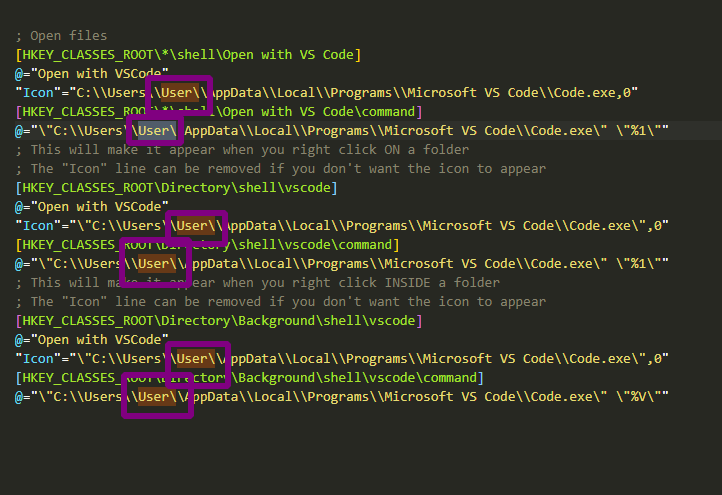

# vscode-open-context-menu 64-bit
This file is to add context menu (right Click) "open with VSCode" command if forgotten before.

## OPEN .reg FILE

## CHECK YOUR USER NAME

If your your pc name is different from Users/User/.... change it
 \User\     >>       \YOUR_REAL_USERNAME\

## SAVE
Save the file

## RUN
Double click your .reg file 

